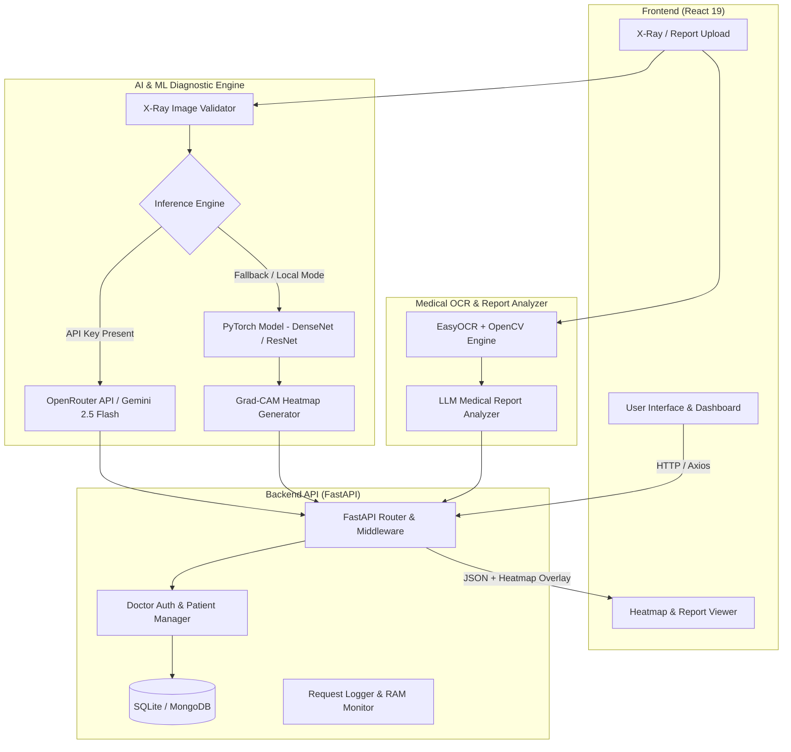

# MediScan AI 🫁

**MediScan AI** is an advanced, production-grade Chest X-ray diagnostic platform and medical report analyzer powered by Deep Learning, Computer Vision, and Cloud LLM Vision Models. It enables healthcare professionals and users to detect 14+ thoracic conditions (including Pneumonia, COVID-19, Tuberculosis, Cardiomegaly, and Atelectasis), view Grad-CAM visual heatmaps, and automatically extract structured medical data from lab reports via OCR.

---

## 🏗️ System Architecture

MediScan AI is designed using a decoupled **Client-Server Architecture**. The platform features a dynamic dual-inference workflow, seamlessly switching between cloud-based Vision LLMs and local PyTorch deep learning models with visual explainability.



---

## 🛠️ Technology Stack

### 🖥️ Frontend (Client)
- **Core Framework:** [React 19](https://react.dev/) (`react` v19.2.5, `react-dom` v19.2.5)
- **Routing:** [React Router](https://reactrouter.com/) (`react-router-dom` v7.18.2)
- **Build Tool:** Create React App (`react-scripts` v5.0.1)
- **HTTP Client:** [Axios](https://axios-http.com/) (`axios` v1.15.2)
- **Iconography:** [Lucide React](https://lucide.dev/) (`lucide-react` v1.11.0)
- **Styling:** Custom Modular CSS with Dark/Light Glassmorphism theme & responsive layouts
- **Deployment:** Hosted on **Vercel** (`mediscan-ai-delta.vercel.app`)

### ⚙️ Backend (Server API)
- **Framework:** [FastAPI](https://fastapi.tiangolo.com/) (Python 3.10+) running with **Uvicorn** & **Gunicorn** ASGI server
- **Database & Auth:** SQLite (`mediscan.db`) with optional MongoDB (`pymongo`) support. Manages Doctor Authentication (salted password hashing), Patient Records, and Diagnostic Scan History
- **Security & Middleware:** CORS Middleware, File Validation (MIME / byte limit checks), Request timing headers, and System resource tracking (`psutil`)
- **Containerization & Hosting:** Dockerized (`Dockerfile`) and deployed on **Render** cloud platform

### 🧠 AI, Deep Learning & Computer Vision
- **Deep Learning Framework:** [PyTorch](https://pytorch.org/) (`torch`, `torchvision`) for multi-label chest radiograph classification
- **Visual Explainability:** **Grad-CAM** (Gradient-weighted Class Activation Mapping) implemented via OpenCV (`opencv-python-headless`), Pillow, NumPy, and Matplotlib
- **Cloud LLM Vision Integration:** **OpenRouter API** linking **Google Gemini 2.5 Flash** for dynamic zero-shot multi-disease risk assessment and automated clinical narrative generation
- **Medical Report OCR:** **EasyOCR** (`easyocr`) coupled with OpenCV image preprocessors for text extraction from lab documents and clinical PDFs
- **OCR Report Analysis:** Custom `MedicalReportAnalyzer` using Gemini LLM for extracting structured lab findings, abnormal values, and recommendations
- **Model Evaluation:** Scikit-learn, Pandas, Seaborn, and Matplotlib for ROC-AUC curves, confusion matrices, and performance metrics tracking

---

## 🌟 Key Features

1. **Multi-Condition X-Ray Classification:** Detects 14+ conditions including Pneumonia, COVID-19, Tuberculosis, Atelectasis, Cardiomegaly, Effusion, Infiltration, Mass, Nodule, Pneumothorax, Consolidation, Edema, Emphysema, Fibrosis, and Pleural Thickening.
2. **Explainable AI (Grad-CAM Heatmaps):** Generates visual heatmaps overlaying lung radiograph areas to highlight pathological regions responsible for model predictions.
3. **Dual Inference Engine:** 
   - Primary: High-accuracy Cloud Vision LLM via OpenRouter & Gemini 2.5 Flash.
   - Local Fallback: Fully offline PyTorch deep neural network when API key is unconfigured or offline.
4. **Medical Report OCR & Parsing:** Upload lab report scans/images to automatically extract text via EasyOCR and generate structured summaries (key metrics, abnormal values, patient recommendations).
5. **Doctor & Patient Dashboard:** Integrated Doctor authentication, patient record management, scan history persistent logging, and clinical metrics visualization.
6. **X-Ray Image Validation:** Automated input checks to ensure uploaded files conform to valid chest radiograph standards.

---

## 📦 Prerequisites & Environment Setup

### 1. External Required Files
Ensure the following files are present in the project root directory before running local inference:
- `.env` (Environment configuration file)
- `pneumonia_model.pth` or `best_model.pth` (Local PyTorch model weights)

### 2. Environment Variables Configuration

#### Backend `.env` (Root Directory or `/backend`)
```env
# Server Config
HOST=0.0.0.0
PORT=5000

# Model Config
MODEL_PATH=pneumonia_model.pth
IMAGE_SIZE=224
DEVICE=auto
CONFIDENCE_THRESHOLD=0.50
DISABLE_GRADCAM=false

# Cloud Vision & LLM APIs
OPENROUTER_API_KEY=your_openrouter_api_key_here
GEMINI_API_KEY=your_gemini_api_key_here
```

#### Frontend `.env` (`/frontend/.env`)
```env
REACT_APP_BACKEND_URL=http://localhost:5000
```

---

## 🚀 Quick Start Guide

### 1. Running the Backend Server
```powershell
# Navigate to the project directory
cd "mediscan ai"

# Activate your virtual environment (recommended)
.\venv\Scripts\Activate.ps1

# Install required Python packages
pip install -r backend/requirements.txt

# Start the FastAPI server
$env:PYTHONIOENCODING="utf-8"
python backend/app.py
```
*The API server will start at `http://localhost:5000` (API docs available at `http://localhost:5000/docs`).*

### 2. Running the Frontend Application
```bash
# Navigate to the frontend directory
cd frontend

# Install Node dependencies
npm install

# Start the React development server
npm start
```
*The application will open at `http://localhost:3000`.*

---

## 🔌 Primary API Endpoints

| Method | Endpoint | Description |
| :--- | :--- | :--- |
| `GET` | `/` | API status check |
| `GET` | `/health` | System health check (CPU/GPU info, RAM usage) |
| `POST` | `/predict` | Primary endpoint: Processes Chest X-Ray image, returns predictions & Grad-CAM heatmap |
| `POST` | `/predict/batch` | Batch process multiple Chest X-Rays |
| `POST` | `/heatmap` | Generates standalone Grad-CAM visual heatmap overlay |
| `POST` | `/ocr` | Extracts text from medical laboratory report using EasyOCR |
| `POST` | `/analyze-report` | Extracts raw OCR text and generates LLM clinical summary |
| `GET` | `/model-info` | Metadata and device information for active models |
| `GET` | `/metrics` | Returns model evaluation metrics and training history |

---

## ☁️ Cloud Deployment

- **Backend (Render):** Deployed using Docker via `backend/Dockerfile` and `backend/render.yaml`. Set `OPENROUTER_API_KEY` in Render environment variables.
- **Frontend (Vercel):** Deployed on Vercel with root directory set to `frontend/`. Environment variable `REACT_APP_BACKEND_URL` points to the Render backend service.

---

## 📄 License & Attribution

Developed for **MediScan AI** research and clinical decision support demonstration.

