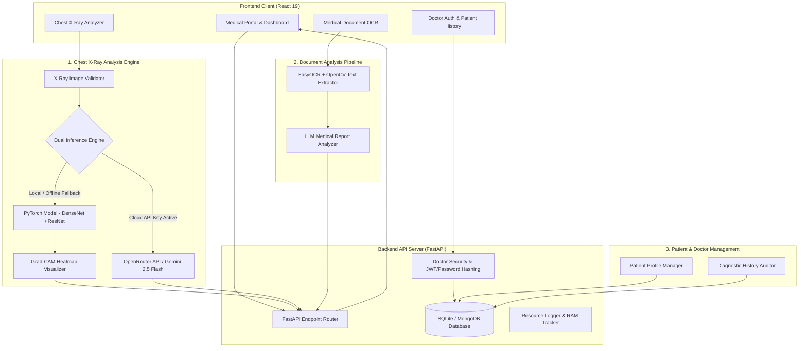

# MediScan AI 🫁

**MediScan AI** is an advanced, production-grade AI Medical Diagnostic Platform integrating **Chest X-ray Computer Vision**, **Medical Document OCR Analysis**, and a **Doctor-Patient Management System**. Powered by PyTorch Deep Learning, Cloud LLM Vision Models (Google Gemini 2.5 Flash via OpenRouter), EasyOCR, and FastAPI, MediScan AI delivers end-to-end clinical decision support for healthcare providers and patients.

---

## 🏗️ System Architecture & Workflow

MediScan AI utilizes a decoupled **Client-Server Architecture** designed for high throughput, local offline fallback resilience, and modular scaling across three core operational pillars:



---

## 🌟 Core Functional Pillars

### 1. 🫁 Chest X-Ray Diagnostic Engine
- **Multi-Condition Pathology Classification:** Classifies 14+ thoracic conditions, including Pneumonia, COVID-19, Tuberculosis, Atelectasis, Cardiomegaly, Effusion, Infiltration, Mass, Nodule, Pneumothorax, Consolidation, Edema, Emphysema, Fibrosis, and Pleural Thickening.
- **Dual Inference Engine:** 
  - *Primary:* High-speed Cloud LLM Vision inference powered by **Google Gemini 2.5 Flash** via **OpenRouter API** for dynamic risk scoring and narrative clinical impressions.
  - *Local Fallback:* Fully offline **PyTorch** deep neural network inference (`pneumonia_model.pth` / `best_model.pth`) when cloud connection is unavailable.
- **Visual Explainability (Grad-CAM):** Generates high-resolution Gradient-weighted Class Activation Maps overlaid on radiograph films to highlight exact lesion areas and region-of-interest anomalies.
- **Radiograph Image Validation:** Automated input sanity check (`xray_validator.pth`) ensuring uploaded media conforms to valid chest radiograph standards.

### 2. 📄 Medical Document Analysis & OCR Pipeline
- **Lab Report Text Extraction:** Uses **EasyOCR** and **OpenCV** image preprocessors to scan, binarize, and extract text from laboratory reports, blood tests, and clinical discharge summaries.
- **AI Structured Report Analysis:** Employs an LLM-driven medical parser (`MedicalReportAnalyzer`) to transform unstructured OCR text into formatted output:
  - Key diagnostic metrics & numerical lab values.
  - Highlighted abnormal range indicators.
  - Clinical summary & primary diagnostic findings.
  - Actionable recommendations for follow-up care.

### 3. 👨‍⚕️ Doctor & Patient History Management System
- **Doctor Authentication & Security:** Secure credential storage using salted password hashing, supporting doctor profiles and role-based access.
- **Patient Management Directory:** Enables doctors to create, search, and update patient profiles with demographic and clinical metadata.
- **Persistent Scan History:** Complete audit trail storing past X-ray predictions, Grad-CAM heatmaps, OCR report summaries, and confidence scores linked to patient IDs.
- **Flexible Database Backend:** Built on **SQLite** (`mediscan.db`) with native support for **MongoDB** via `pymongo`.

---

## 🛠️ Complete Technology Stack

### 🖥️ Frontend (Client Application)
- **Framework:** [React 19](https://react.dev/) (`react` v19.2.5, `react-dom` v19.2.5)
- **Routing:** [React Router](https://reactrouter.com/) (`react-router-dom` v7.18.2)
- **Build Tooling:** Create React App (`react-scripts` v5.0.1)
- **HTTP Communications:** [Axios](https://axios-http.com/) (`axios` v1.15.2)
- **Icons & UI Assets:** [Lucide React](https://lucide.dev/) (`lucide-react` v1.11.0)
- **Styling:** Custom Modular CSS with Dark/Light Glassmorphism theme, tabbed patient views, and responsive layouts
- **Deployment:** Hosted on **Vercel** (`mediscan-ai-delta.vercel.app`)

### ⚙️ Backend (Server API)
- **Framework:** [FastAPI](https://fastapi.tiangolo.com/) (Python 3.10+) running on **Uvicorn** & **Gunicorn** ASGI server
- **Database & Storage:** SQLite (`mediscan.db`) with optional MongoDB (`pymongo`) integration
- **Security & Middleware:** CORS Middleware, Upload MIME/size validation (10MB limit), Request timing headers (`X-Process-Time`), System RAM tracking (`psutil`)
- **Deployment:** Dockerized (`Dockerfile`, `render.yaml`) and deployed on **Render**

### 🧠 AI, Deep Learning & Vision Technologies
- **Deep Learning Framework:** [PyTorch](https://pytorch.org/) (`torch`, `torchvision`)
- **Visual Heatmap Generation:** Grad-CAM using OpenCV (`opencv-python-headless`), Pillow, NumPy, and Matplotlib
- **Cloud Vision LLM:** OpenRouter API integration pointing to **Google Gemini 2.5 Flash**
- **OCR Engine:** EasyOCR (`easyocr`) & OpenCV for text detection and extraction
- **Report Analysis:** Custom LLM Medical Parsing Pipeline (`report_analysis/report_analyzer.py`)
- **Data & Metrics Evaluation:** Scikit-learn, Pandas, Seaborn, and Matplotlib for evaluation matrices, ROC-AUC curves, and metrics tracking

---

## 📦 Prerequisites & Setup

### 1. Required External Files
Ensure the following files exist in the project root directory:
- `.env` (Environment keys)
- `pneumonia_model.pth` or `best_model.pth` (Local model weights)

### 2. Environment Variables Configuration

#### Backend `.env` (Root Directory or `/backend`)
```env
# Server Configuration
HOST=0.0.0.0
PORT=5000

# Model Configuration
MODEL_PATH=pneumonia_model.pth
IMAGE_SIZE=224
DEVICE=auto
CONFIDENCE_THRESHOLD=0.50
DISABLE_GRADCAM=false

# Cloud Vision & LLM APIs
OPENROUTER_API_KEY=your_openrouter_api_key_here
GEMINI_API_KEY=your_gemini_api_key_here

# Database Configuration (Optional)
MONGO_URI=
```

#### Frontend `.env` (`/frontend/.env`)
```env
REACT_APP_BACKEND_URL=http://localhost:5000
```

---

## 🚀 Quick Start Guide

### 1. Start the Backend API Server
```powershell
# Open terminal in project root
cd "mediscan ai"

# Activate Python virtual environment
.\venv\Scripts\Activate.ps1

# Install requirements
pip install -r backend/requirements.txt

# Launch FastAPI server
$env:PYTHONIOENCODING="utf-8"
python backend/app.py
```
*API running at `http://localhost:5000` (Swagger documentation at `http://localhost:5000/docs`).*

### 2. Start the Frontend App
```bash
# Open terminal in frontend directory
cd frontend

# Install packages
npm install

# Start React app
npm start
```
*App running at `http://localhost:3000`.*

---

## 🔌 Core API Endpoint Reference

| Method | Endpoint | Description | Module |
| :--- | :--- | :--- | :--- |
| `GET` | `/` | API status check | System |
| `GET` | `/health` | System health check (CPU/GPU info, RAM usage) | System |
| `POST` | `/predict` | Processes Chest X-Ray, returns predictions & Grad-CAM heatmap | Chest X-Ray |
| `POST` | `/predict/batch` | Batch process multiple X-Ray images | Chest X-Ray |
| `POST` | `/heatmap` | Generates standalone Grad-CAM visual heatmap | Chest X-Ray |
| `POST` | `/ocr` | Extracts raw text from medical lab document using EasyOCR | Document OCR |
| `POST` | `/analyze-report` | Analyzes raw OCR text and returns structured clinical summary | Document Analysis |
| `POST` | `/auth/login` | Doctor authentication & session setup | Auth & History |
| `GET` | `/patients` | Fetch patient list and diagnostic history | Auth & History |
| `GET` | `/model-info` | Read active model metadata and hardware info | System |
| `GET` | `/metrics` | View performance evaluation metrics | Analytics |

---

## ☁️ Deployment

- **Backend (Render):** Docker container (`Dockerfile` & `render.yaml`). Add `OPENROUTER_API_KEY` in Render environment variables.
- **Frontend (Vercel):** Deployed with root directory set to `frontend/`. Set `REACT_APP_BACKEND_URL` to your Render service URL.

---

## 📄 License & Attribution

Developed for **MediScan AI** research and clinical decision support demonstration.

