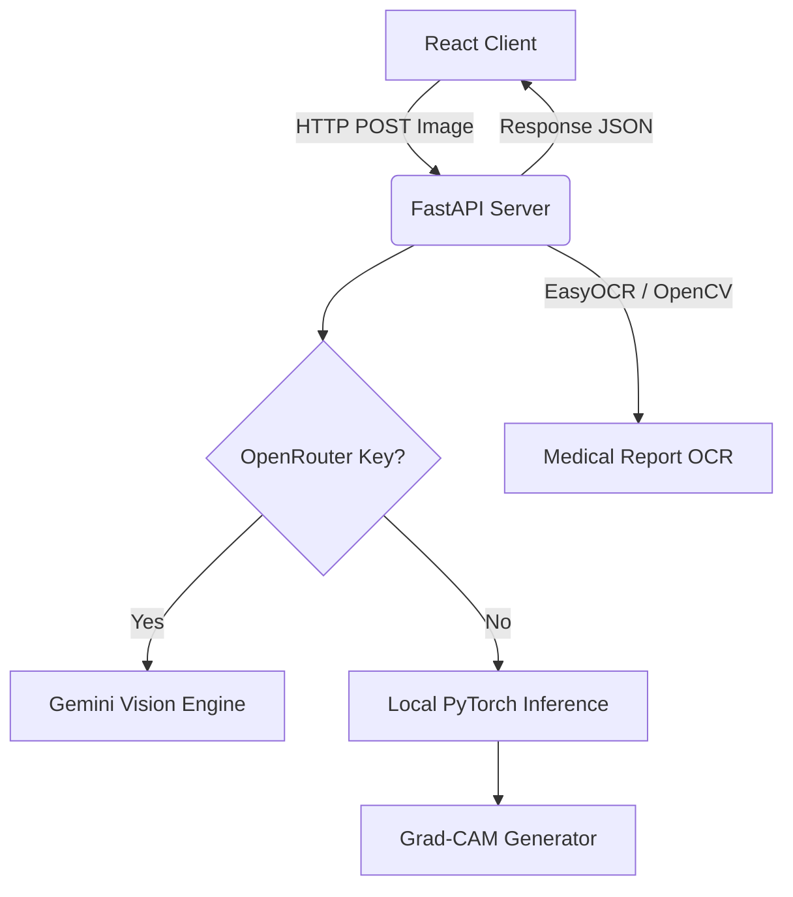

# MediScan AI: Technical Stack & Integration Guide

Welcome to the integration guide for **MediScan AI**. This document provides an in-depth breakdown of the project's technical architecture, dependencies, API specifications, and setup instructions to help your team seamlessly integrate, extend, or interact with this platform.

---

## 🧭 Architecture Overview

MediScan AI consists of a decoupled **React frontend** and a **FastAPI backend**. It is designed to perform medical image analysis (specifically Chest X-rays) using both cloud-based LLM vision models (via OpenRouter/Gemini) and local deep learning fallbacks (PyTorch).



---

## 💻 Frontend Technology Stack

The client-side application is built using a modern, responsive single-page application framework.

*   **Core Library:** React 19 (`react` @ `19.2.5`, `react-dom` @ `19.2.5`)
*   **Build tool:** Create React App (`react-scripts` @ `5.0.1`)
*   **HTTP Client:** Axios (`axios` @ `1.15.2`) for API calls.
*   **Icons:** Lucide React (`lucide-react` @ `1.11.0`)
*   **Styling:** Responsive, modern CSS structure.

---

## ⚙️ Backend Technology Stack

The server-side application is built on a high-performance Python ASGI framework.

*   **API Framework:** FastAPI (`fastapi` with `uvicorn` and `gunicorn` ASGI servers)
*   **Deep Learning:** PyTorch (`torch`, `torchvision`)
*   **OCR Engine:** EasyOCR (`easyocr` with `opencv-python-headless`) for report parsing
*   **Image Processing:** Pillow (`Pillow`), NumPy (`numpy`), and OpenCV
*   **Data Analysis & Visualization:** Pandas, Scikit-learn, Matplotlib, Seaborn (for metric evaluations and heatmap generation)
*   **Validation & Serialization:** Pydantic (`pydantic` v2)

---

## 🛠️ API & Integration Endpoints

The backend server runs on `http://localhost:5000` by default. It provides the following key endpoints:

| Endpoint | Method | Description | Payload / Response |
| :--- | :--- | :--- | :--- |
| `/` | `GET` | API status | `{"message": "MediScan AI Backend running with FastAPI"}` |
| `/health` | `GET` | System health check (CPU/GPU info, RAM) | Status, uptime metrics |
| `/predict` | `POST` | Process Chest X-Ray image for classifications | Multipart form: `image` (JPEG/PNG). Returns predictions & heatmaps. |
| `/predict/batch` | `POST` | Batch process multiple Chest X-Rays | Multipart form: multiple `files`. Returns a list of predictions. |
| `/heatmap` | `POST` | Generate Grad-CAM heatmaps separately | Multipart form: `image`. Returns Grad-CAM image data. |
| `/ocr` | `POST` | Run EasyOCR text extraction on medical documents | Multipart form: `image`. Returns structured extracted texts. |
| `/model-info` | `GET` | Read active model metadata and weights info | DenseNet/ResNet model path and device settings. |
| `/metrics` | `GET` | Performance metrics evaluation history | JSON representation of model performance. |

---

## 🔑 Environment Variables Configuration

Both frontend and backend rely on configuration files (`.env`). Ensure these keys are configured correctly:

### Backend `.env` (Root Directory)
```env
# Server Config
HOST=0.0.0.0
PORT=5000

# Model Config
MODEL_PATH=pneumonia_model.pth
IMAGE_SIZE=224
DEVICE=auto
CONFIDENCE_THRESHOLD=0.50
DISABLE_GRADCAM=false

# LLM Integrations
OPENROUTER_API_KEY=your_openrouter_api_key_here
GEMINI_API_KEY=your_gemini_api_key_here
HF_API_KEY=your_huggingface_api_key_here
```

### Frontend `.env` (`/frontend` Directory)
```env
REACT_APP_BACKEND_URL=http://localhost:5000
```

---

## ☁️ Deployment Pipelines

*   **Backend Deployment:** CPU-optimized Docker container deployed to **Render** or any container host (e.g., AWS ECS, GCP Cloud Run). A production-grade `Dockerfile` and `render.yaml` are located in the root folder.
*   **Frontend Deployment:** Hosted on **Vercel** or **Netlify**. Set the build command to `npm run build` and output directory to `build`.
